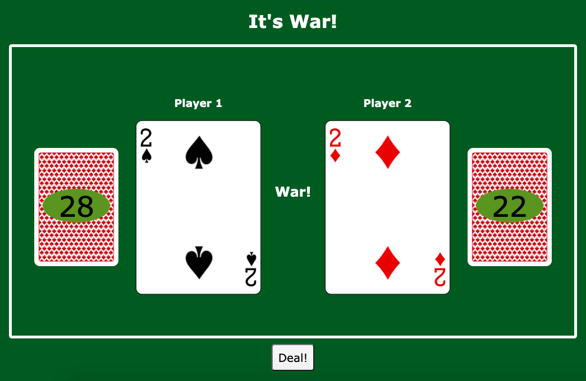

# War - the Card Game

The classic game of War easily playable by a single person! Simply click the "Deal!" button, and watch as the computer draws for both players and adjusts their scores and decks accordingly.

**Find the project here!** https://sierragreen379.github.io/War_Card_Game

## How It's Made:

**Tools Used:** HTML, CSS, JavaScript

I used the Deck of Cards API at https://www.deckofcardsapi.com to generate the card images and values. I also used the API to keep track of what cards are in which player's pile. That way, the players can keep drawing and drawing until one of them is out of cards.

To accurately compare the drawn cards, I wrote a function to change the face cards and the ace to a numerical value. This way, they can be accurately compared to each other and the other numeric cards to find the winner. 

The game layout has only one button, which means only one type of interactivity. It was designed this way to allow only one person to play a two-player game. While the design could have imitated a player-against-computer game, the game itself is entirely luck based. So if both piles are decided by the API, why not choose for yourself who to root for?

## Lessons Learned:
Some of the things I learned while building this project include:
- How confusing large functions can get. Some of my functions are 40-50 lines long and include logic for several different things. This got overwhleming at times, and if I were to optimize the code better, I'd make a lot of smaller functions just to break it all up and make it more easily comprehendable.
- How to work with a third-party API. This API was pretty easy to use as the documentation was pretty good. But there was still a lot of console.logging my actual return values so as to retrieve the correct thing.
- How to do something differently and still get the same result. The API has you automatically drawing from the top of the deck. But when you add to a pile, it adds the card to the top of the deck with no parameter to put it on the bottom. So when drawing from the top, the player would always get the same card if they kept winning. Nothing would change. So I had to have the players draw from the bottom of their piles so as to imitate drawing from the top and adding cards to the bottom. The user will never know the difference.